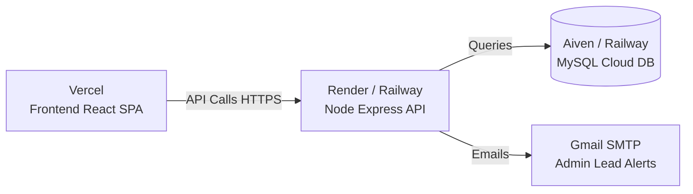

# 🚀 Live Production Deployment Guide
### Bahumukhi Real Estate Portal (Frontend + Backend API + MySQL DB)

This guide walks you through taking the application live on the web step-by-step.

---

## 📑 Table of Contents
1. [Step 1: Setup Email Alerts (Inquiry Leads to Admin)](#step-1-setup-email-alerts)
2. [Step 2: Database Migration (Export & Import)](#step-2-database-migration)
3. [Deployment Option A: Free / Managed Cloud (Recommended)](#deployment-option-a-free--managed-cloud-recommended)
   - [A.1 Database on Aiven or Railway](#a1-free-cloud-mysql-database)
   - [A.2 Backend on Render](#a2-backend-on-render)
   - [A.3 Frontend on Vercel](#a3-frontend-on-vercel)
4. [Deployment Option B: Single VPS with Docker Compose](#deployment-option-b-single-vps-with-docker-compose)
5. [Connecting Custom Domain & SSL](#connecting-custom-domain--ssl)

---

## Step 1: Setup Email Alerts

When customers submit the inquiry form on any property detail page, an email with all customer and property details will be sent directly to the Admin.

### Gmail SMTP Setup (Fastest & Free)
1. Go to your **Google Account** > **Security** > enable **2-Step Verification**.
2. Search for **"App passwords"** (or visit `https://myaccount.google.com/apppasswords`).
3. Enter App name (e.g. `Real Estate Website`) and click **Create**.
4. Copy the generated **16-character password** (e.g., `abcd efgh ijkl mnop`).
5. Configure in your backend environment variables:
   ```env
   SMTP_HOST=smtp.gmail.com
   SMTP_PORT=465
   SMTP_SECURE=true
   SMTP_USER=your_email@gmail.com
   SMTP_PASS=your_16_char_app_password
   ADMIN_EMAIL=info@bahumukhi.com
   EMAIL_FROM="Bahumukhi Real Estate <noreply@bahumukhi.com>"
   ```

---

## Step 2: Database Migration

Export your local database with your properties and tables:

```bash
# 1. Export local MySQL database to a dump file
mysqldump -u root -p real_estate > real_estate_backup.sql
```

When you create your live cloud database, you can import this file:
```bash
# 2. Import into remote cloud MySQL
mysql -h <REMOTE_HOST> -u <REMOTE_USER> -p<REMOTE_PASSWORD> <REMOTE_DB_NAME> < real_estate_backup.sql
```

---

## Deployment Option A: Free / Managed Cloud (Recommended)

This option offers zero server maintenance, automated deployments on GitHub push, and free tiers.



### A.1 Free Cloud MySQL Database (Aiven or Railway)
1. Sign up at [Aiven.io](https://aiven.io) or [Railway.app](https://railway.app).
2. Create a new **MySQL** service (free tier / free trial).
3. Copy the connection details:
   - **Host** (e.g., `mysql-xxx.aivencloud.com`)
   - **Port** (e.g., `12345`)
   - **User** (e.g., `avnadmin` or `root`)
   - **Password**
   - **Database Name** (e.g., `defaultdb` or `real_estate`)
4. Import your `real_estate_backup.sql` using MySQL Workbench, DBeaver, or command line.

---

### A.2 Backend on Render (render.com)
1. Push your project to a GitHub repository.
2. Sign up at [Render.com](https://render.com) and click **New +** > **Web Service**.
3. Connect your GitHub repository.
4. Set the following configuration:
   - **Name**: `real-estate-backend`
   - **Root Directory**: `backend`
   - **Runtime**: `Node`
   - **Build Command**: `npm install`
   - **Start Command**: `npm start`
5. Under **Environment Variables**, add:
   ```env
   NODE_ENV=production
   PORT=5001
   DB_HOST=<YOUR_CLOUD_DB_HOST>
   DB_USER=<YOUR_CLOUD_DB_USER>
   DB_PASSWORD=<YOUR_CLOUD_DB_PASSWORD>
   DB_NAME=<YOUR_CLOUD_DB_NAME>
   JWT_SECRET=<GENERATE_A_RANDOM_LONG_SECRET>
   ADMIN_PASSWORD_HASH=<YOUR_ADMIN_BCRYPT_HASH>
   FRONTEND_URL=https://your-frontend.vercel.app
   SMTP_HOST=smtp.gmail.com
   SMTP_PORT=465
   SMTP_SECURE=true
   SMTP_USER=your_email@gmail.com
   SMTP_PASS=your_16_character_app_password
   ADMIN_EMAIL=info@bahumukhi.com
   EMAIL_FROM="Bahumukhi Real Estate <noreply@bahumukhi.com>"
   ```
6. Click **Create Web Service**. Once deployed, copy your backend URL (e.g., `https://real-estate-backend.onrender.com`).

---

### A.3 Frontend on Vercel (vercel.com)
1. Sign up at [Vercel.com](https://vercel.com) and click **Add New...** > **Project**.
2. Import your GitHub repository.
3. In the project settings:
   - **Framework Preset**: `Vite`
   - **Root Directory**: `frontend`
   - **Build Command**: `npm run build`
   - **Output Directory**: `dist`
4. Under **Environment Variables**, add:
   - `VITE_API_URL` = `https://real-estate-backend.onrender.com` (Your Render backend URL without trailing slash)
5. Click **Deploy**.
6. Your website is now live on `https://your-project.vercel.app`! 🎉

---

## Deployment Option B: Single VPS with Docker Compose

If you have a Linux VPS (Ubuntu on DigitalOcean, AWS EC2, Hetzner, Linode):

1. **Install Docker & Docker Compose** on your server:
   ```bash
   sudo apt update && sudo apt install -y docker.io docker-compose
   ```
2. **Clone your project** to `/var/www/real-estate`:
   ```bash
   git clone <YOUR_GIT_REPO_URL> /var/www/real-estate
   cd /var/www/real-estate
   ```
3. **Configure production environment variables** in `backend/.env` and `frontend/.env`.
4. **Launch containers**:
   ```bash
   docker-compose up -d --build
   ```
5. **Setup Nginx reverse proxy & Let's Encrypt SSL**:
   ```bash
   sudo apt install -y certbot python3-certbot-nginx nginx
   sudo certbot --nginx -d yourdomain.com -d api.yourdomain.com
   ```

---

## Connecting Custom Domain & SSL

- **Frontend on Vercel**: Go to Project Settings > **Domains** > Add `bahumukhi.com` or `www.bahumukhi.com`. Point your domain DNS A/CNAME record to Vercel. Vercel automatically creates free SSL.
- **Backend on Render**: Go to Web Service Settings > **Custom Domains** > Add `api.bahumukhi.com`.
- **CORS Update**: Update `FRONTEND_URL` in backend env to `https://bahumukhi.com` and `VITE_API_URL` in frontend env to `https://api.bahumukhi.com`.

---

## ✅ Deployment Checklist
- [x] Email inquiry notification system configured with Nodemailer
- [x] HTML email template formatted with customer & property details
- [x] Rate limiting active on backend APIs
- [x] Cross-Origin (CORS) security whitelist ready
- [x] Frontend production bundle verified (`npm run build` passes)
- [ ] Fill in `SMTP_USER` and `SMTP_PASS` in production backend environment
- [ ] Connect remote MySQL database
- [ ] Deploy to Render/Vercel or VPS
